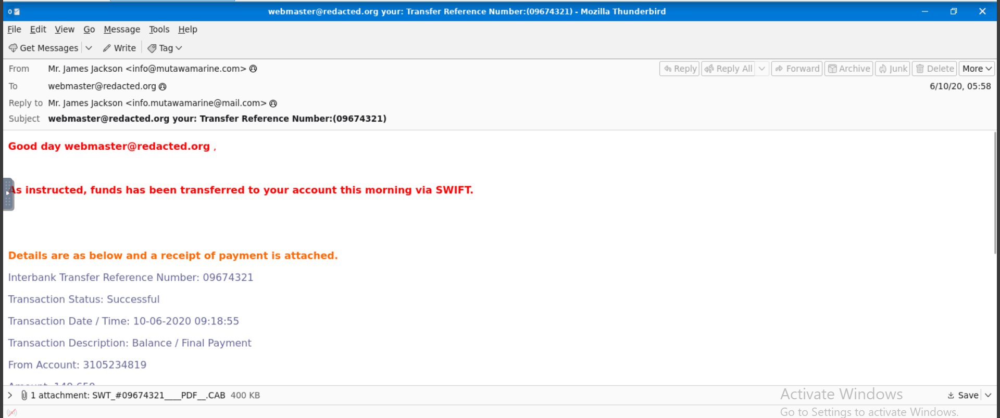
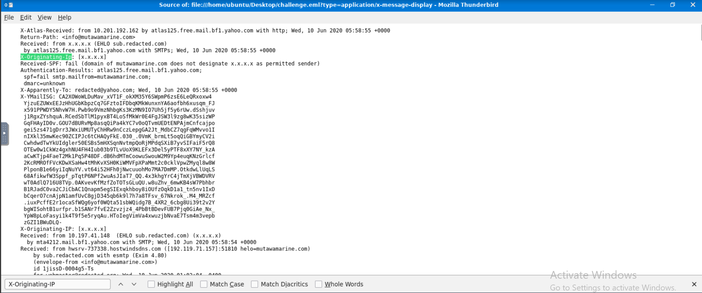
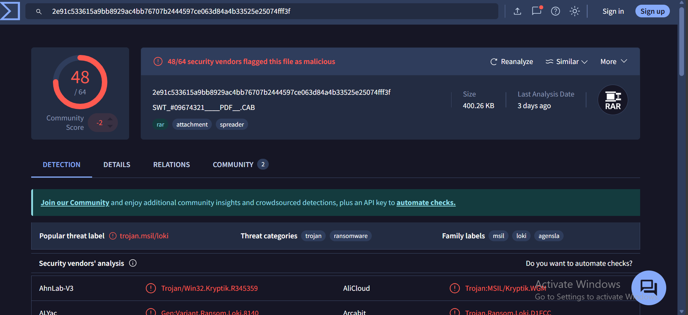

# Phishing Email Analysis Report

**Analyzed by:** Inioluwa Ojo
**Date:** 12/6/2025

---

## 1. Executive Summary

A suspicious email impersonating a customer of Greenholt PLC was analyzed after being reported by a Sales Executive. The email used an unusual generic greeting (“Good day”), referenced an unexpected SWIFT funds transfer, and included a payment-receipt attachment the user did not request. These elements deviated from the customer’s established communication pattern. The attachment was confirmed malicious by multiple Antivirus (AV) vendors, indicating a trojan-based financial phishing attempt likely intended to compromise credentials or deliver malware.

# Key Findings

- The attachment was flagged as malicious by multiple antivirus engines on VirusTotal.
- The email contained a trojan payload disguised as a SWIFT payment receipt.
- The attacker attempted to leverage familiarity by impersonating a known customer.
- The email spoofed the sender domain and failed critical email authentication checks (SPF/DMARC).

---

## 2.Email Preview

Source code view of the email which contains vital information about the mail such as the SPF status, DMARC status and other email security information

---

## 3. Technical Analysis

### Sender & Subject Details

- **From:** `info@mutawamarine.com`
- **Subject:** `webmaster@redacted.org your: Transfer Reference Number:(09674321)`
- **Reply-To:** `info.mutawamarine@mail.com` (A common tactic to direct replies to a different, non-spoofed address)

### Malicious Attachment Details

- **Filename:** `SWT_#09674321____PDF__.CAB`
- **SHA256 Hash:** `2e91c533615a9bb8929ac4bb76707b2444597ce063d84a4b33525e25074fff3f`
- **File Type:** RAR/CAB compressed file containing the trojan payload
- **VirusTotal Result:** 48/64 security vendors flagged the file as malicious. Popular threat label: `trojan.msil/loki`.

### Email Authentication Details

The raw email header indicated severe authentication failure:

- `Authentication-Results: atlas125.free.mail.bf1.yahoo.com;`
- `spf=fail smtp.mailfrom=mutawamarine.com;`
- `dmarc=unknown`

The explicit **SPF `fail`** confirms that the "From" address (`info@mutawamarine.com`) was used without authorization of the legitimate domain owner, which is a classic technique used in phishing and trojan delivery attacks.

---

## 4. Attack Workflow

The incident followed a standard financially motivated attack chain:

1.  **Profiling:** Attacker profiles the target using publicly available information on Greenholt PLC and its staff.
2.  **Spoofing:** Attacker spoofs a customer's identity using a misconfigured domain to appear legitimate.
3.  **Lure Crafting:** Crafts a phishing lure referencing a fake SWIFT payment and attaches a "receipt" to trigger urgency and financial motivation.
4.  **Payload Delivery:** Embeds the trojan payload inside a compressed malicious file (CAB/RAR) disguised as a payment document.
5.  **Delivery:** Delivers the phishing email directly to the Sales Executive’s inbox, bypassing weak authentication controls.
6.  **Malware Execution:** Relies on user interaction (opening/extracting the attachment) to initiate malware execution.
7.  **Containment:** SOC intervention stops the attack after the user reports the email, leading to IOC extraction and threat containment.

---

## 5. Indicators of Compromise (IOCs)

| Type       | Value                                                              | Description                                              |
| :--------- | :----------------------------------------------------------------- | :------------------------------------------------------- |
| **FILE**   | `2e91c533615a9bb8929ac4bb76707b2444597ce063d84a4b33525e25074fff3f` | SHA256 Hash of the Trojan disguised as a payment receipt |
| **DOMAIN** | `info@mutawamarine.com`                                            | Spoofed sender email address/domain                      |

---

## 6. Tools and Techniques Used

- **Email Client (Thunderbird):** Used to view the original email and extract the full header/source code for forensic analysis.
- **VirusTotal:** Malware triage and hash analysis
- **Local Sandbox / VM:** Safe environment for file inspection
- **File Analyzer:** Checking file metadata

---

## 7. Recommendations and Mitigation Strategy

These recommendations focus on hardening security controls and training employees to prevent recurrence.

### 6.1 Enhanced Technical Controls (Email Gateway & Infrastructure)

These recommendations focus on hardening the organization's email infrastructure to automatically block or flag similar threats in the future.

- **Enforce DMARC Policy to Reject Failed Emails:** The analysis showed the attacker successfully exploited a lack of stringent email authentication controls (evidenced by the SPF `fail` result). It is a **High Priority** to move the domain’s DMARC policy from monitoring (`p=none`) to **Quarantine** (`p=quarantine`), with a plan to escalate to **Reject** (`p=reject`) within 90 days. This will instruct recipient mail servers globally to block emails using your domain that fail authentication, effectively preventing external spoofing.
- **Block Malicious File Hashes and Attachment Types:** The extracted SHA256 hash must be immediately pushed to the Endpoint Detection and Response (**EDR**) system and Email Security Gateway to prevent future execution. Furthermore, update email gateway rules to quarantine or strip known high-risk, compressed file types like **.CAB** and **.RAR** when received from external sources, as these are commonly used to mask malicious payloads.
- **Implement Anti-Impersonation and Display Name Rules:** Configure the email gateway's anti-spoofing policies to flag or block emails where the sender's friendly **Display Name** matches a known internal user or customer, but the actual sending email address is external and unverified. This directly addresses the social engineering tactic used in this incident.

### 6.2 User Education and Awareness

These recommendations target the human firewall, ensuring employees are equipped to recognize and report sophisticated phishing attempts.

- **Targeted Security Awareness Training for High-Risk Teams:** Conduct mandatory, role-based phishing training for the **Sales and Finance teams** immediately. Training should focus specifically on **Financial Lures** (e.g., unexpected SWIFT transfers, urgent payment requests) and non-technical red flags, such as generic greetings and unexpected attachments.
- **Reinforce Incident Reporting Procedures:** Commend the Sales Executive who reported this email correctly. Use this incident as a success story to reinforce the **"See Something, Say Something"** culture and ensure all employees know the clear, immediate process for reporting suspicious or unsolicited communications without fear of reprisal.
- **Policy Review of Sensitive Information Handling:** Review and circulate policies requiring employees to use independent, verified channels (like a phone call to a known number) to confirm any urgent, unsolicited requests for financial changes or fund transfers, regardless of the sender's apparent identity.
